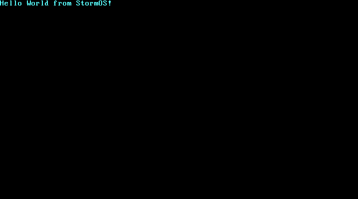

# storm-os
Very basic OS being created following this blog: https://os.phil-opp.com/

## Setup
If you haven't done this before, you will need to run `rustup component add rust-src --toolchain nightly-x86_64-unknown-linux-gnu` (will vary depending on the OS you are currently running) for Rust nightly to work.

Add `bootloader` as a dependency in cargo.toml like this: `bootloader = "0.9.8"`, then install the `bootimage` tool with `cargo install bootimage`.

Run `cargo bootimage` and it should create a bootable disk image.

If you are using `rust-analyzer` with VSCode, it is recommended to add this to your `settings.json` file in order to avoid errors being shown that aren't actually happening.
```
{
    "rust-analyzer.checkOnSave.allTargets": false,
}
```

## Running in VM
Firstly install QEMU, then run `cargo run`.

If it works, you should see this.


